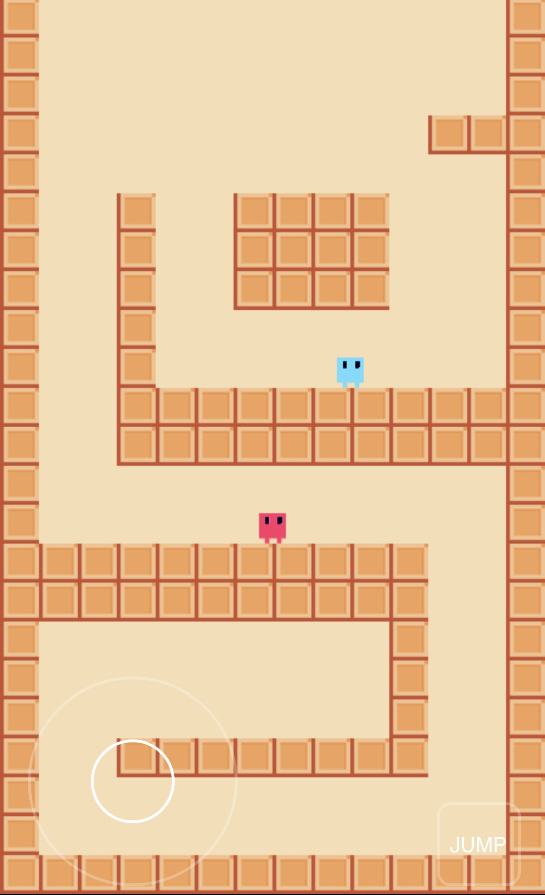

# 2D Parkour – PhaserJS Platformer Sample 

This sample project uses Phaser3 and Arcade Physics to create a 2D platformer with parkour mechanics.

This is an attempt to make the perfect platformer game mechanics as seen on games like Super Meat Boy. Essentially a combination of learnings from [Game Mechanic Explorer](https://gamemechanicexplorer.com/#platformer-1) and [this](http://www.emanueleferonato.com/2017/06/16/the-basics-behind-wall-jump-in-platform-games-html5-prototype-made-with-phaser-and-arcade-physics/) wonderful "wall jump" method by Emanuele Feronato.

## What's Included

- Fully customizable player movement and wall climbing/jumping physics. This implementation includes:
  - Player acceleration/deceleration on movement
  - Variable jump height based on how long the jump button is pressed
  - Option to enable double jump
  - Wall jump and wall to wall jumping
  - Wall sliding when holding the joystick towards the wall
- 2D sample tile map to demonstrate the mechanics
- Sync players using [PlayroomKit](https://docs.joinplayroom.com)
- Uses PlayroomKit's [Joystick](https://docs.joinplayroom.com/multiplayer/joystick) component for touch controls

### Demo

You can see a demo of this project [here](https://2dparkour.joinplayroom.com).

## Getting Started

To get started, clone this directory and run `npm install` to install the dependencies.
Then run `npm run dev` to start the development server.

