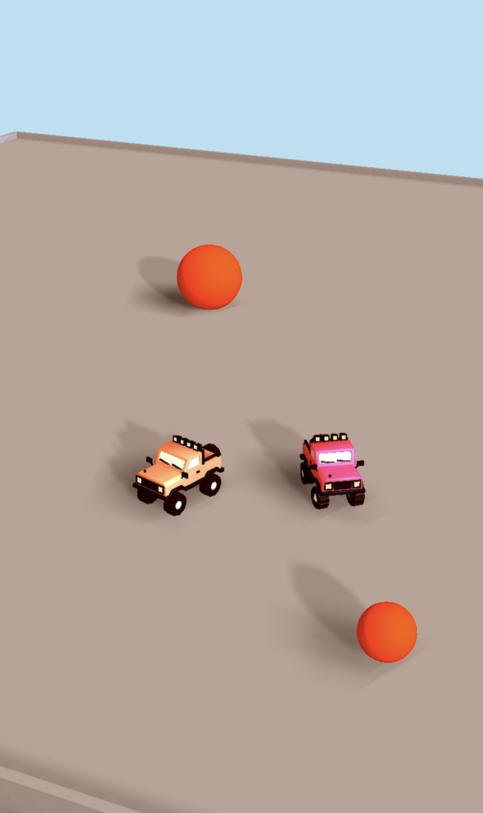

# Car On Roof – Three.js + Cannon Sample

This is a sample project that uses Three.js, Cannon and PlayroomKit to create an isometric car game. The car physics and model are from [Bruno Simon's website](https://bruno-simon.com/).

**Note:** The code for loading model is in `src/carmodel.js`, this also applies basic materials to the model. You can also replace `loadCar` import with one in `src/carmodel_basic.js` to see a dummy car model with box and torus shape instead of the actual car model.

## What's Included

- A basic car model with car physics
- A touch joystick using [nipplejs](https://yoannmoi.net/nipplejs/)
- A simple isometric scene with a few spheres on the ground
- Very basic networked physics using [PlayroomKit](https://docs.joinplayroom.com)
## Demo

You can see a demo of this project [here](https://carsonroof.joinplayroom.com).

## Getting Started

To get started, clone this directory and run `npm install` to install the dependencies.
Then run `npm run dev` to start the development server.

