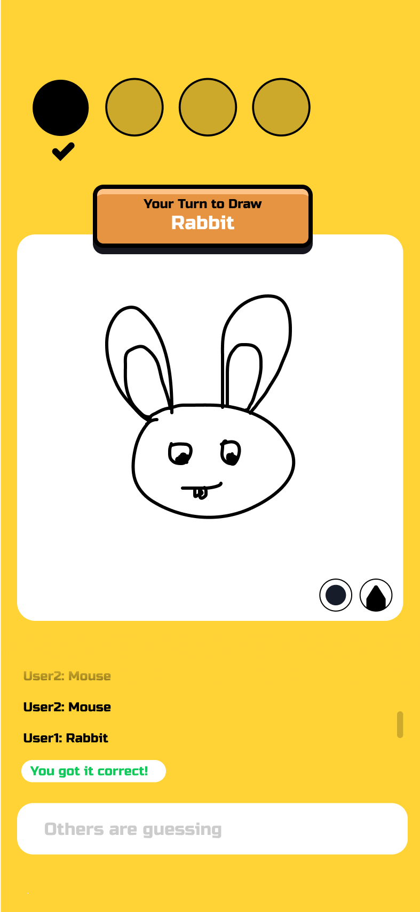

# Drawing Game React Sample

This is a sample project that uses React and PlayroomKit to create a pictionary style game.

## Demo

You can see a demo of this project [here](https://draw.joinplayroom.com/).

## Getting Started

To get started, clone this directory and run `npm install` to install the dependencies.
Then run `npm run dev` to start the development server.

