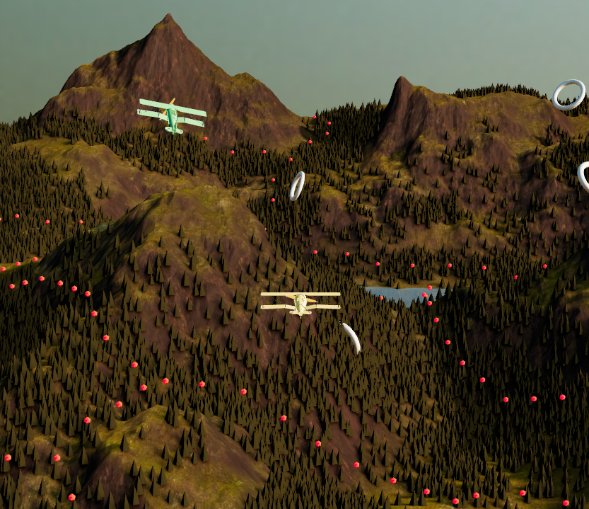

# r3f-plane-rings

This code is almost fully based on [Irradiance's Tutorial: Build an Airplane Flying Game with React Three Fiber & Three.js](https://www.youtube.com/watch?v=kU77JU7tluc) but modified to be multiplayer using Playroom.

```
npm install
npm run dev
```


