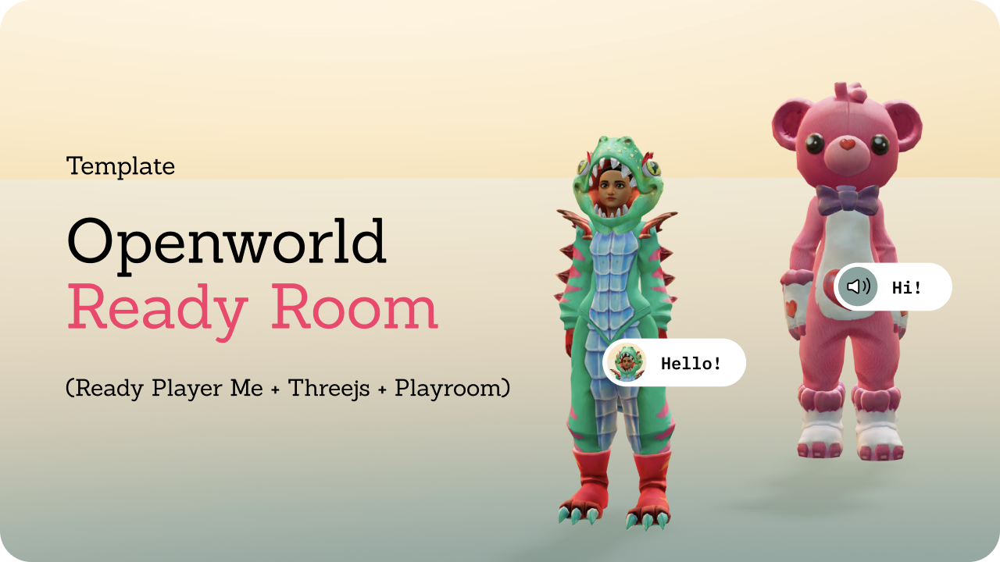

# Playroom + Ready Player Me + Agora Integration

A demo template for Playroom kit integration with Ready Player Me and Agora voice chat. This one is more complete than the other simpler one.

## Demo
https://readyroom.dev/

## Usage

You probably need to edit `./r3f-readyplayerme_withagora/src/utils/agora_manager.js` with your own Agora App ID.

Then you can run the as usual:

```bash
yarn install
yarn dev
```